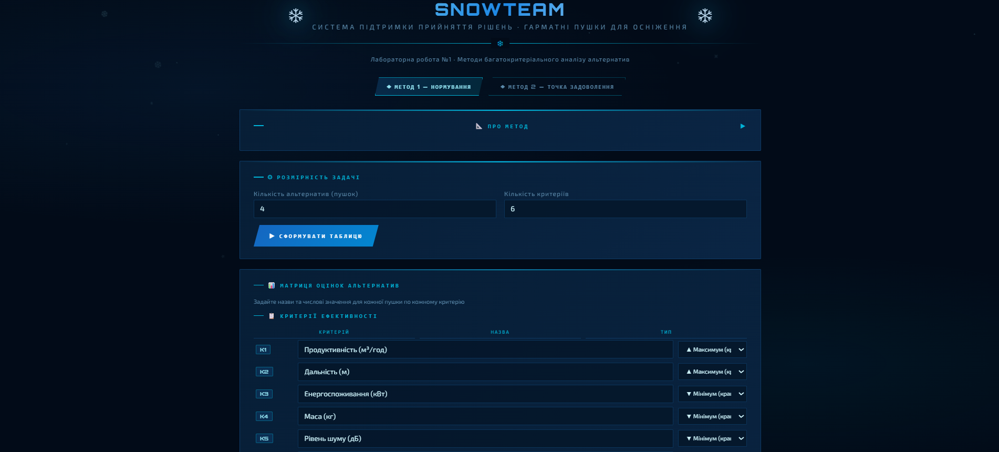

# ❄ SnowTeam — Система підтримки прийняття рішень

### Багатокритеріальний аналіз гарматних пушок для осніження

[](https://romankozar.github.io/dss-snow-cannons/)
[](https://github.com/RomanKozar/dss-snow-cannons)
[](https://github.com/RomanKozar/dss-snow-cannons/releases)



> **Лабораторна робота №1** · Методи багатокритеріального аналізу альтернатив

---

## 📋 Опис додатку

Веб-додаток реалізує **СППР** для вибору найкращої снігової гармати серед кількох альтернатив за багатьма критеріями. Реалізований на чистому **HTML + CSS + JS** (один файл `index.html`, без залежностей).

---

## ⚙️ Як користуватися

**Крок 1** — Задайте кількість пушок (2–8) та критеріїв (2–10), натисніть «Сформувати таблицю».

**Крок 2** — Заповніть дані:

- Назва та тип кожного критерію (`▲ Макс` або `▼ Мін`)
- Назви пушок
- Числова матриця оцінок
- Ваги критеріїв (довільний інтервал — програма нормує автоматично)
- Точка задоволення T _(тільки Метод 2)_

**Крок 3** — Оберіть згортку → «❄ Обчислити».

---

## 🔢 Реалізовані методи

### Метод 1 — Нормування [0; 1]

```
max-критерій:  z = (O − min) / (max − min)
min-критерій:  z = (max − O) / (max − min)
```

### Метод 2 — Точка задоволення ОПР

```
zᵢⱼ = 1 − |tᵢ − Oᵢⱼ| / max{ tᵢ − min(Oᵢ) ; max(Oᵢ) − tᵢ }
```

- `z = 1` → ідеал досягнуто; `z = 0` → найдальше від T; `z < 0` → ще гірше за найгіршого

---

## 📐 Згортки

| Згортка             | Формула         | Характеристика              |
| ------------------- | --------------- | --------------------------- |
| **M₁ Песимістична** | `1 / Σ(αᵢ/zᵢⱼ)` | Штрафує за слабкий критерій |
| **M₂ Обережна**     | `Π(zᵢⱼ^αᵢ)`     | Геометрична                 |
| **M₃ Середня**      | `Σ αᵢ·zᵢⱼ`      | Лінійна, **рекомендована**  |
| **M₄ Оптимістична** | `√(Σ αᵢ·zᵢⱼ²)`  | Завищує оцінки              |

**Субординація:** M₁ ≤ M₂ ≤ M₃ ≤ M₄

---

## 📊 Блоки результатів

| Блок                  | Опис                                  |
| --------------------- | ------------------------------------- |
| Картки рейтингу       | Місце і оцінка кожної пушки           |
| Барчарт               | Візуальне порівняння                  |
| Таблиця згорток       | Порівняння M₁–M₄ (режим «Всі чотири») |
| Нормована матриця Z   | Синій = max, сірий = min у рядку      |
| Вагові коефіцієнти αᵢ | Нормовані ваги (Σαᵢ = 1)              |
| Висновок              | Рейтинг та пояснення                  |

---

## 🗂 Структура файлів

```
📁 SnowTeam-СППР/
├── 📄 index.html    ← Додаток (HTML + CSS + JS в одному файлі)
└── 📄 README.md     ← Цей файл
```

---

## 🛠 Технічний стек

|              |                           |
| ------------ | ------------------------- |
| HTML5        | Розмітка                  |
| CSS3         | Стилі + анімація сніжинок |
| Vanilla JS   | Обчислення та рендер      |
| Google Fonts | Orbitron + Exo 2          |

Зовнішні бібліотеки та фреймворки: **не використовуються**.

---

## 📐 Формули (зведено)

```
αᵢ = pᵢ / Σpᵢ,  Σαᵢ = 1

M₁(xⱼ) = 1 / Σ(αᵢ / zᵢⱼ)
M₂(xⱼ) = Π(zᵢⱼ ^ αᵢ)
M₃(xⱼ) = Σ αᵢ · zᵢⱼ
M₄(xⱼ) = √(Σ αᵢ · zᵢⱼ²)

M₁ ≤ M₂ ≤ M₃ ≤ M₄  ∀x ∈ X
```

---
